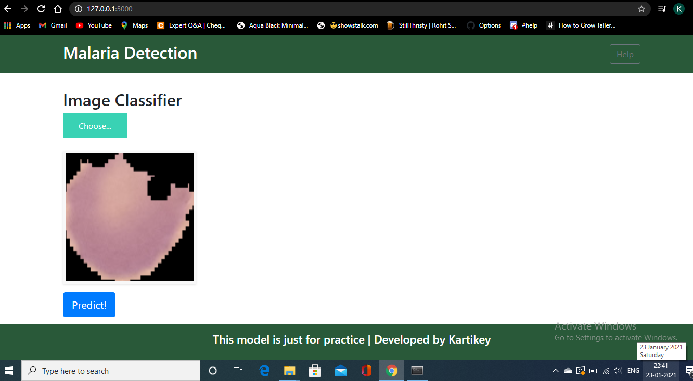
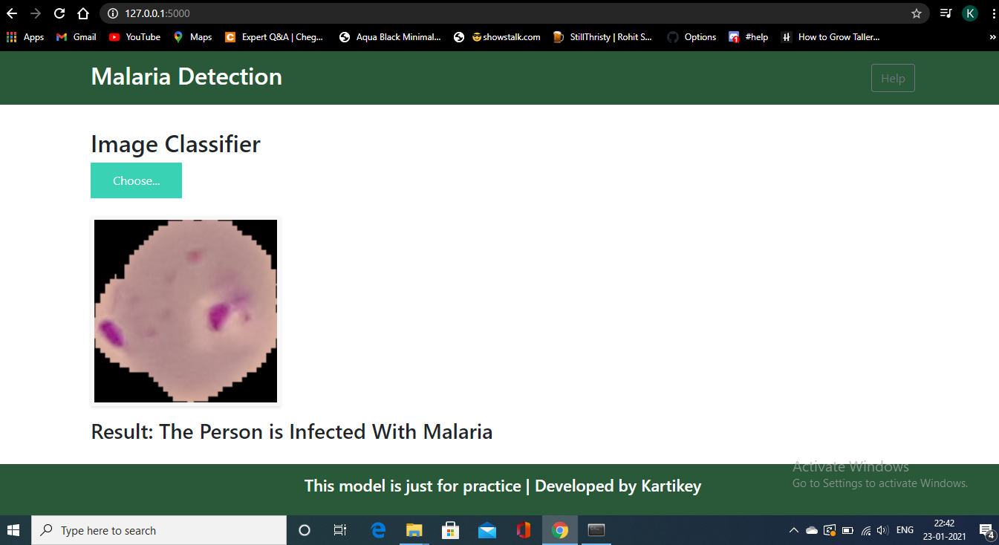

# malaria_detection
Initial UI of the web app look like this 

Here we have uploaded an uninfected cell image from our system

Now after clicking the predict button, our model predict following result

Now an infeected cell image is uploaded from our system

The prediction for this image is shown below

